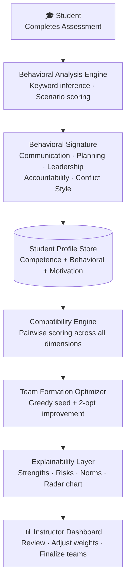

# Behavioral Team Formation

> AI-assisted team formation using behavioral signatures, explainable matching, and instructor-guided team generation.

[](#)
[](#)
[](#)
[](#)

---

## Overview

Team formation is one of the most consequential decisions in project-based learning — and one of the least systematically studied. Most instructors rely on self-reported skill surveys, schedule availability, or intuition. These approaches routinely produce teams that are technically balanced but behaviorally incompatible: members who cannot agree on how to communicate, how to resolve conflict, or how to share ownership.

This project proposes a different framing. Rather than treating team formation as a scheduling and skills problem, we treat it as a **behavioral compatibility problem**. We hypothesize that the primary drivers of team dysfunction — uneven accountability, communication friction, leadership conflicts, and unresolved disagreement — are predictable from behavioral signatures captured before teams are formed.

**Behavioral Team Formation** is a full-stack research prototype that operationalizes this hypothesis. It collects behavioral data through scenario-based assessments, constructs multi-dimensional student profiles, optimizes team composition across behavioral and competency dimensions simultaneously, and generates explainable team assignments with per-team working norm recommendations.

The system is designed not as a black-box recommender but as an **instructor-in-the-loop** tool: the instructor controls the weighting of each dimension, reviews generated teams alongside their compatibility scores and risk factors, and receives automatically generated team norms derived from the behavioral profile of each group.

---

## Research Motivation

### The Problem with Current Approaches

Most existing team formation systems in academic settings rely on one or more of the following:

- **Self-reported skills** — students rate themselves on technical competencies, which are subject to overconfidence bias, anchoring effects, and strategic misrepresentation
- **Schedule availability** — systems match on overlapping free time, which correlates poorly with actual collaboration quality
- **Instructor judgment** — instructors rely on prior observation and reputation, which is inconsistent at scale and impossible in large courses or first-semester cohorts
- **Random or voluntary assignment** — widely used despite strong evidence that both strategies produce worse outcomes than structured assignment

These approaches share a fundamental limitation: they treat the team as a collection of skill slots to fill, rather than as a social system with emergent dynamics. They capture *what* students can do, not *how* they work together.

### The Gap: Behavioral Compatibility

Research in organizational psychology has consistently shown that team dysfunction is driven primarily by relational and behavioral factors rather than technical ones. Jehn & Mannix (2001) identified that **process conflict** — disagreement over how work should be done — is more damaging to team performance than task conflict over what to do. Lencioni (2002) documented how **accountability asymmetry** — where some team members take responsibility and others do not — is the most common failure mode in student project teams.

These behavioral dimensions are rarely captured by any team formation tool designed for academic settings.

### Behavioral Signatures

We introduce the concept of a **behavioral signature**: a structured representation of a student's characteristic approach to collaborative work, inferred from their responses to realistic conflict and coordination scenarios.

A behavioral signature captures five dimensions:

| Dimension | What it measures |
|-----------|-----------------|
| **Communication Style** | Preference for async written communication vs. synchronous real-time interaction |
| **Planning Orientation** | Tendency toward structured milestone planning vs. adaptive, spontaneous scheduling |
| **Leadership Style** | Approach to coordination — directive, facilitative, or emergent |
| **Accountability** | Consistency of self-directed follow-through on commitments |
| **Conflict Handling** | Response to interpersonal and technical disagreement — avoidant, collaborative, or confrontational |

Unlike self-assessed skill ratings, behavioral signatures are harder to game and more stable across contexts. They are inferred from *how* a student responds to a scenario, not from how they rate themselves on a competency scale.

---

## Research Question

> **Can behavioral-signature-based matching produce better team outcomes than traditional skill-only or schedule-based matching?**

This prototype is designed as a first step toward answering that question empirically. Future evaluation will measure:

- **Team satisfaction** — student-reported experience at project midpoint and end
- **Workload balance** — self-reported contribution equity across team members
- **Conflict frequency and severity** — measured via structured retrospective surveys
- **Project outcomes** — instructor-rated deliverable quality and process scores
- **Behavioral prediction accuracy** — correlation between predicted and observed team dynamics

---

## System Architecture



---

## Core Components

### Behavioral Assessment

Students respond to six scenario-based prompts designed to surface authentic behavioral tendencies. Each scenario presents a realistic team conflict or coordination challenge and asks the student to choose from structured response options, with an optional free-text elaboration field.

The six scenarios are:

| # | Scenario | Behavioral Dimension Targeted |
|---|----------|-------------------------------|
| 1 | Teammate missed a critical deadline | Conflict handling, accountability |
| 2 | Workload imbalance within the team | Conflict handling, help-seeking |
| 3 | Communication breakdown and silence | Leadership, communication style |
| 4 | Leadership vacuum at project start | Leadership style, planning orientation |
| 5 | Strong technical disagreement | Conflict handling, decision-making |
| 6 | Ambiguous project requirements | Planning orientation, leadership |

The current implementation uses keyword-based inference over structured option choices and free-text responses. The architecture includes a clean interface for replacing this with LLM-powered inference in a future iteration — see [`backend/ai/`](backend/ai/).

---

### Behavioral Signatures

Each student's behavioral signature is stored as a structured profile with five key dimensions:

**Communication Style** (`async` · `sync` · `mixed`)
Captures whether a student prefers documented, asynchronous communication or real-time synchronous discussion. Mismatches between strongly async and strongly sync members are a common source of perceived unresponsiveness and friction.

**Planning Orientation** (`planner` · `adaptive` · `spontaneous`)
Captures whether a student prefers fixed milestones and structured timelines or flexible, iterative scheduling. Asymmetry on this dimension is a leading predictor of deadline-related conflict.

**Leadership Style** (`directive` · `facilitative` · `emergent`)
Captures how a student approaches team coordination. Multiple directive members in one team is a significant risk factor; a mix of facilitative and directive styles is typically productive.

**Accountability** (`high` · `medium` · `low`)
Captures self-directed follow-through. Teams with asymmetric accountability — high and low members together — show the highest rates of resentment and contribution imbalance.

**Conflict Handling** (`collaborative` · `confrontational` · `avoidant`)
Captures the student's default response to interpersonal and technical disagreement. All-avoidant teams suppress necessary conflict; all-confrontational teams escalate it. Mixed teams with at least one collaborative member perform best.

---

### Team Formation Engine

Teams are generated using a two-phase greedy optimization algorithm:

**Phase 1 — Greedy construction.** The student with the highest *connector score* (broadest coverage of reference skills) seeds each team. Remaining students are added iteratively, each time selecting the unassigned student who maximizes the team's marginal weighted compatibility score.

**Phase 2 — 2-opt improvement.** One full pass of pairwise member swaps between teams. If swapping member A from team *i* and member B from team *j* increases the combined score of both teams, the swap is committed.

**Scoring formula:**

```
total_score = w₁ × skill_coverage
            + w₂ × behavioral_compatibility
            + w₃ × availability_overlap
            + w₄ × interest_alignment
```

Default weights:

| Dimension | Default Weight | Scoring Method |
|-----------|---------------|----------------|
| Skill Coverage | **40%** | Jaccard overlap with 12-skill reference set |
| Behavioral Compatibility | **30%** | Average pairwise score across conflict, leadership, planning, accountability |
| Availability Overlap | **20%** | Average pairwise Jaccard similarity on availability slots |
| Interest Alignment | **10%** | Jaccard similarity on union of learning goals and interests |

Weights are **instructor-adjustable** via the dashboard before each run.

---

### Explainability Engine

Every generated team includes a full explanation package:

**Match Confidence Score** — a meta-score reflecting how reliably this team was identified as the best assignment. Computed from the team's relative position in the score distribution; penalized when scores cluster tightly (near-tie pool) or when the student pool is small.

**Team Strengths** — rule-derived observations about what makes this team's composition effective. Examples: skill breadth, behavioral complementarity, facilitative leadership presence, scheduling alignment.

**Risk Factors** — identified structural risks: multiple directive leaders, all-avoidant conflict style, low availability overlap, accountability asymmetry. Named by member when relevant, so instructors can intervene proactively.

**Behavioral Radar Chart** — a five-axis SVG visualization showing the team's average behavioral profile across all five dimensions, with per-member traces overlaid. Gives instructors an immediate visual read of behavioral spread and alignment.

**Suggested Team Norms** — five automatically generated working agreements derived from the team's behavioral majority patterns, covering: communication cadence, conflict resolution protocol, decision-making approach, planning structure, and accountability check-ins. Designed as a starting point for the team's own charter discussion, not as a top-down mandate.

---

## Student Profile Model

Each student profile is structured across five signature layers:

```python
Student
├── id: str
├── name: str
│
├── CompetenceSignature
│   ├── skills: List[str]           # e.g. ["frontend", "ml", "testing"]
│   ├── roles: List[str]            # e.g. ["tech-lead", "ux-designer"]
│   └── experience_level: str       # "beginner" | "intermediate" | "advanced"
│
├── WorkRhythmSignature
│   ├── planning_style: str         # "planner" | "spontaneous" | "adaptive"
│   ├── communication_style: str    # "async" | "sync" | "mixed"
│   ├── execution_style: str        # "methodical" | "iterative" | "exploratory"
│   └── availability: List[str]     # e.g. ["Mon-morning", "Wed-evening", "Sat-anytime"]
│
├── CollaborationSignature
│   ├── conflict_style: str         # "avoidant" | "confrontational" | "collaborative"
│   ├── leadership_style: str       # "directive" | "facilitative" | "emergent"
│   ├── accountability: str         # "high" | "medium" | "low"
│   └── help_seeking: str           # "proactive" | "reactive" | "independent"
│
├── MotivationLayer
│   ├── interests: List[str]        # e.g. ["machine learning", "open source"]
│   └── learning_goals: List[str]   # e.g. ["system design", "user research"]
│
└── ConfidenceLayer
    └── confidence_score: float     # [0.0, 1.0] — inferred from response assertiveness
```

Profiles are created or updated automatically when a student submits the behavioral assessment. The competence signature can also be seeded manually via the API or the included sample dataset.

---

## Example Workflow

```
Student visits /assessment
        │
        ▼
Answers 6 scenario-based prompts
(structured option + optional free-text elaboration)
        │
        ▼
Behavioral Signature Generated and Saved
(student profile appears in instructor's pool)
        │
        ▼
Instructor Opens Dashboard
Reviews student pool, adjusts weighting sliders
        │
        ▼
AI Generates Teams
Greedy optimization + 2-opt improvement
        │
        ▼
Instructor Reviews Explainable Recommendations
Per-team: compatibility score, match confidence,
radar chart, strengths, risk factors, team norms
        │
        ▼
Teams Finalized and Communicated
```

---

## Current Features

### Implemented

- [x] Scenario-based behavioral assessment (6 scenarios, 4 options each)
- [x] Automatic behavioral signature inference (keyword + option-choice analysis)
- [x] Student profile creation and update on assessment submit
- [x] Competence signature with skills, roles, and experience level
- [x] Greedy + 2-opt team formation optimizer
- [x] Four-component weighted compatibility scoring
- [x] Match confidence score per team
- [x] Conflict risk diagnostic metric
- [x] Per-team behavioral radar chart (SVG, team avg + member overlays)
- [x] Team explainability: strengths, risks, prose explanation
- [x] Automated team norm generation (5 categories per team)
- [x] Instructor dashboard with adjustable weighting sliders
- [x] Clean AI interface layer for future LLM integration
- [x] 20-student seed dataset with diverse profiles
- [x] REST API with full OpenAPI documentation

### Planned

- [ ] LLM-powered behavioral inference (Claude API integration via `backend/ai/`)
- [ ] LLM-generated explanations and team norms
- [ ] Longitudinal team health tracking across project milestones
- [ ] Student-facing team profile view
- [ ] Classroom pilot deployment (target: Fall 2026)
- [ ] Empirical evaluation study with control and treatment groups
- [ ] Behavioral prediction validation against observed outcomes
- [ ] Export to course management system formats (Canvas, Gradescope)

---

## Screenshots

### Landing Page
> *Screenshot coming soon*

### Behavioral Assessment
> *Screenshot coming soon*

### Instructor Dashboard
> *Screenshot coming soon*

### Generated Teams
> *Screenshot coming soon*

### Team Profile
> *Screenshot coming soon*

---

## Repository Structure

```
behavioral-team-formation/
│
├── backend/
│   ├── app/
│   │   ├── main.py                  FastAPI application, CORS, shared state, seed loading
│   │   ├── models.py                All Pydantic v2 data models
│   │   ├── behavioral_analysis.py   Assessment scenarios and analyze endpoint
│   │   ├── matching.py              Greedy optimizer, 2-opt improvement, match confidence
│   │   └── explainability.py        Explanation, radar chart, and team retrieval endpoints
│   │
│   ├── ai/
│   │   ├── interfaces.py            Abstract base classes — the LLM integration contract
│   │   ├── mock_analyzer.py         Keyword-based BehavioralAnalyzer (current implementation)
│   │   ├── mock_explainer.py        Rule-based ExplanationGenerator + NormGenerator
│   │   └── README.md                Guide for swapping in a real LLM
│   │
│   ├── sample_students.json         20 diverse seed student profiles
│   └── requirements.txt
│
├── frontend/
│   ├── app/
│   │   ├── page.tsx                 Landing page
│   │   ├── assessment/page.tsx      Behavioral assessment form
│   │   ├── dashboard/page.tsx       Instructor dashboard
│   │   ├── teams/page.tsx           Generated teams overview
│   │   └── team/[id]/page.tsx       Individual team detail and analysis
│   │
│   ├── components/
│   │   ├── Navigation.tsx           Site-wide navigation header
│   │   ├── RadarChart.tsx           Pure SVG behavioral radar chart
│   │   ├── ScoreBar.tsx             Reusable score progress bar
│   │   └── TeamMetricsPanel.tsx     Five-metric team profile panel
│   │
│   └── lib/
│       ├── types.ts                 TypeScript interfaces mirroring all backend models
│       └── api.ts                   Typed API client with proper Content-Type headers
│
├── docs/
│   └── architecture.md             Full architecture documentation and Mermaid diagrams
│
├── prompts/
│   ├── behavioral_assessment.txt    LLM prompt template for behavioral inference
│   └── explanation_generation.txt  LLM prompt template for explanation generation
│
└── README.md
```

---

## Local Development

### Prerequisites

- Python 3.12+
- Node.js 20+
- npm

### Backend

```bash
cd backend

# First-time setup
python -m venv venv
source venv/bin/activate          # Windows: venv\Scripts\activate
pip install -r requirements.txt

# Start the development server
uvicorn app.main:app --reload --port 8000
```

The API will be available at `http://localhost:8000`.
Interactive API documentation (Swagger UI) is available at `http://localhost:8000/docs`.

### Frontend

```bash
cd frontend

# First-time setup
npm install

# Start the development server
npm run dev
```

The frontend will be available at `http://localhost:3000`.

> **Note:** The frontend expects the backend running on port 8000. Both servers must be running for the full demo.

---

## API Overview

| Method | Endpoint | Description |
|--------|----------|-------------|
| `GET`  | `/students` | List all students in the formation pool |
| `GET`  | `/assessment/scenarios` | Retrieve the six built-in assessment scenarios |
| `POST` | `/assessment/analyze` | Submit responses, infer behavioral signature, upsert student profile |
| `POST` | `/teams/generate` | Run formation optimizer with specified weights and team size |
| `GET`  | `/teams/teams` | List all generated teams |
| `GET`  | `/teams/{id}` | Retrieve a specific team with full score breakdown |
| `GET`  | `/teams/{id}/explanation` | Get explanation, strengths, risks, and team norms |
| `GET`  | `/teams/{id}/radar` | Get behavioral radar chart data (team average + per-member) |

All `POST` requests require `Content-Type: application/json`.
Full schema documentation is available at `/docs` when the backend is running.

---

## Research Roadmap

### Phase 1 — Prototype *(current)*
Build and validate the core system: behavioral assessment pipeline, compatibility optimizer, explainability engine, and instructor interface. Establish the technical foundation for empirical evaluation.

### Phase 2 — Classroom Pilot Study *(target: Fall 2026)*
Deploy the system in one or two sections of a CS project course. Collect behavioral signatures for all enrolled students and generate team assignments using the system. Administer pre- and post-project surveys measuring team satisfaction, workload balance, and conflict frequency. Compare outcomes against a control section using traditional assignment methods.

### Phase 3 — Behavioral Signature Validation
Analyze whether specific behavioral mismatches (e.g., directive + directive leadership, all-avoidant conflict style) predict observed team dysfunction. Assess the predictive validity of the signature model against actual team performance data. Refine the scoring formula and behavioral dimensions based on empirical findings.

### Phase 4 — LLM Integration and Enhancement
Replace keyword-based behavioral inference with LLM-powered analysis using the existing `ai/` interface layer. Evaluate whether richer inference improves prediction accuracy. Explore LLM-generated team norms and recommendations calibrated to course-specific context.

### Phase 5 — Publication and Open Deployment
Write up findings for submission to an educational technology or CSCW venue. Release the system as an open-source tool for adoption by other instructors and researchers.

---

## Future Research Directions

This prototype sits at the intersection of several active research areas:

**Educational AI and Learning Analytics** — How can behavioral modeling improve learning outcomes in project-based courses? What are the ethical implications of inferring and acting on behavioral data in educational settings?

**Explainable Recommendation Systems** — The team formation problem is a structured recommendation task. This system contributes a case study in explainability-by-design: every recommendation is scored, decomposed, and narrated before it reaches the instructor.

**Behavioral Inference from Text** — The scenario-response format is a lightweight instrument for eliciting behavioral signals. Future work will evaluate whether LLM-powered inference significantly outperforms keyword-based scoring, and whether behavioral signatures are stable over time.

**Human-AI Collaboration** — The instructor-in-the-loop design reflects a deliberate stance: AI should augment instructor judgment, not replace it. How do instructors interact with AI-generated team recommendations? Do they override them? Do they trust them more when explanations are provided?

**Team Dynamics and Group Cognition** — Do behaviorally-matched teams develop stronger shared mental models? Do they surface and resolve conflict earlier? These questions connect to foundational research in group cognition and organizational behavior.

---

## Contributors

This project is open to collaboration. If you are a researcher working on educational AI, team dynamics, or human-computer interaction and are interested in contributing or running a joint pilot study, please open an issue or reach out directly.

| Role | Contributor |
|------|------------|
| Research Lead & System Design | Prisha Nag |
| *Future contributors welcome* | — |

---

## Citation

If you reference this work in a paper, thesis, or technical report, please use the following placeholder citation (to be updated upon publication):

```bibtex
@misc{nag2026behavioral,
  title        = {Behavioral Team Formation: AI-Assisted Team Assignment
                  Using Behavioral Signatures and Explainable Matching},
  author       = {Nag, Prisha},
  year         = {2026},
  note         = {Research prototype. \url{https://github.com/prishanag/behavioral-team-formation}},
  institution  = {CS Department}
}
```

---

## License

MIT License © 2026 Prisha Nag

This software is provided for research and educational purposes. See [LICENSE](LICENSE) for full terms.

---

*Behavioral Team Formation is an active research project. The system is a prototype — it has not been evaluated in a live classroom setting and should not be used as the sole basis for team assignment decisions without instructor review.*
